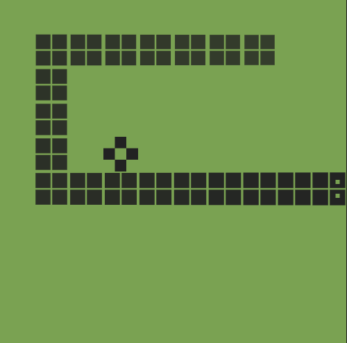

# Snake

## Information about an app:
It works like good old snake game from nokia 3310\
You have to eat to grow bigger. The bigger you are - the higher score you get.\
**Goal**: hit the highest score you can.\
If you hit barrier - you die.\
If you hit snake - you die.

## Additional information:
You can change speed of the game in **Settings**.\
Top 10 scores can be found in **Scoreboard**.

## How to run project

After cloning / downloading repository run `npm install` from project directory to install snake app.\
To start app run `npm start`\
Afterwards open [http://localhost:3000](http://localhost:3000) to view it in the browser.

## Used dependencies

Core dependencies came from `create-react-app`\
Additional dependencies:\
`enzyme`\
`enzyme-to-json`\
`node-sass`\
`prop-types`\
`@reduxjs/toolkit`\
`react-redux`\
`react-router-dom`\
`eslint`\
`eslint-config-airbnb`\
`eslint-config-prettier`\
`eslint-plugin-import`\
`eslint-plugin-jsx-a11y`\
`eslint-plugin-prettier`\
`eslint-plugin-react`\
`eslint-plugin-react-hooks`\
`prettier`